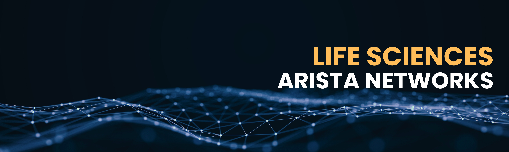

# __**Arista Life Sciences Quarterly Newsletter**__
Welcome to the Arista Life Sciences Quarterly Newsletter, where we explore industry trends, put AI at the forefront, and co-innovate with you to build networks that empower life sciences.

---
<!-- ## __**Upcoming Events**__   -->

<!-- -   __**Local   Events**__ -->
-   

    | Date         | Name                                     | Description                                                                                                                                                                                                                         | Registration                                                                                       |
    |--------------|------------------------------------------|-------------------------------------------------------------------------------------------------------------------------------------------------------------------------------------------------------------------------------------|-------------------------------------------------------------------------------------------------------------|
    | __December 9, 2025__  | Networking for the AI: Arista AI 101 | AI is changing the way businesses operate, and networks must evolve to keep up. Join Arista for a high-level look at how intelligent infrastructure powers AI-driven operations.                                             | Virtual   [Register](https://events.arista.com/2025-12-09-virtual-arista-networking-for-the-ai-era-arista-ai-101){.register-link}      

## __**Keeping Pace with a Seismic Shift in Life Sciences**__

Since our founding, Arista Networks has driven networking innovation through close collaboration with our customers, enabling new capabilities that have achieved required business outcomes. From **reducing latency** for high-frequency traders, to **providing essential telemetry** for hyperscalers’ automation, to building PTP, multicast, and bandwidth management to deliver the **level of reliability** required by media broadcasters, Arista has helped *redefine what's possible in networking*.

Now, the life sciences sector is at a similar **inflection point**. The convergence of AI-driven discovery, data-intensive research, and automated manufacturing demands a new, **unified approach** to infrastructure. Arista is ready to collaborate with life sciences customers to lead this change, helping to reduce operational complexity, increase research efficiency, and improve business agility.

### **A Modern Approach to Infrastructure**

Our **Modern Operating Model** principles enable a **standards-based, fully automated,** and **vendor-agnostic** architecture. This approach can streamline operations and reduce costs for Life Sciences IT, Research IT, and Manufacturing. By simplifying and standardizing network operations, we eliminate **vendor lock-in** and create a consistent foundation for scale, visibility, and innovation, empowering scientists to focus on what matters most: *breakthrough discovery.*

### **Defining the Future of High-Performance AI Networking**

We’re also helping define the future of high-performance AI networking as a founding member of the **[Ultra Ethernet Consortium (UEC](https://ultraethernet.org/)**[)](https://ultraethernet.org/). Ultra Ethernet is closing the performance gap with InfiniBand, unlocking **open, scalable, and deterministic** performance for AI, HPC, and data-intensive research.

The pace of innovation in life sciences isn’t slowing, and neither are we. In this issue, we explore how modern networking is enabling the next generation of scientific discovery and why **now is the moment to rethink what your infrastructure can achieve**.

---
## **In This Quarter’s Issue**

### __**AI that runs with your network, not just on it**__ 

After Generative AI captured headlines with LLMs and advanced model training, the rise of **Agentic AI** is poised to transform not just how we work, but how we design and operate the networks that power our enterprises. Unlike traditional AI tools, Agentic AI acts as a trusted collaborator, capable of automating network design, diagnosing issues in real time, and proactively remediating problems before users even notice them. 

[This new reality demands a rethinking of the network itself.](https://blogs.arista.com/blog/generative-and-agentic-ai-networking-revolution) **Agentic AI can only be as effective as the data and infrastructure it draws upon**, making real-time telemetry, unified state, and open programmability mission-critical. At Arista, we have built the foundations for this future with EOS and NetDL, providing the consistency and context that AI agents require to operate intelligently. By bringing these capabilities to life with AVA and CloudVision, we’re enabling leaders to transform networking from a cost center into a driver of innovation. The next era of networking is here, one where AI isn’t just running on the network; it is running *with* the network.

### **The fastest GPU is only as fast as the slowest packet!**

Refer to our latest blog: *[AI Networking - Observability Blueprint for Modern AI Workloads](https://blogs.arista.com/blog/ai-networking-the-observability-blueprint-for-modern-ai-workloads)* 

As AI adoption accelerates, the network—not compute—has become the biggest bottleneck. Even small misconfigurations, congestion hotspots, or aging cables can stall GPUs, waste millions in compute, and delay innovation. **In AI training, “good enough” networking simply isn’t good enough.**

Arista is redefining AI infrastructure. Our **Etherlink AI platforms** maximize bandwidth and cut tail latency so GPU clusters stay fully utilized. **CloudVision AI** delivers real-time, job-level observability, linking network, system, and application data so teams know exactly which jobs are impacted, why, and where—resolving issues in minutes, not hours. And with built-in compliance tracking, CVE monitoring, and anomaly detection, security is integrated from the start.

### **The Rise of the AI Center**
**The real value lies not in the parts, but in what they enable together.**

[The new AI Center](https://www.arista.com/assets/data/pdf/Whitepapers/AI-Network-WP.pdf) embraces the reality of today’s interconnected research environment. Gone are the days of siloed systems. Or of managing separate, complex networks with competing technologies and specialized expertise.

Life sciences teams need more than faster GPUs; they need infrastructure that can keep up with the speed of discovery. **Arista’s next-generation approach to AI networking is open, vendor-agnostic, and built for scale across any compute platform.**

In this new model, everything is connected. GPUs rely on fast, lossless networks to complete training efficiently. Once trained, AI models must flow instantly to inference clusters to power real-time insights. Compute nodes — from accelerators to CPUs — need seamless access to storage and existing IT systems. The network becomes the central nervous system, enabling every connection, every insight, every breakthrough.

***The real value lies not in the parts, but in what they enable together.*** Just as human thought emerges from neurons linked by the nervous system, the AI Center delivers value by integrating training, inference, storage, and IT into one responsive, resilient system.

By eliminating silos, Arista powers a research infrastructure that’s faster to tune, easier to operate, and ready to scale. This is the future of discovery, built on simplicity, speed, and seamless integration. Read our AI Whitepaper to dig deeper.

## __**Looking Ahead: The Future of Life Sciences Networking**__

Innovation in life sciences isn’t slowing down, and neither can your network. Arista is committed to being more than just a technology vendor. We’re your strategic partner in building a research network that’s fast, secure, and ready for what’s next.

Look out for our upcoming life sciences events, technical deep dives, and webinars. At these events, we’ll share insights from leading research organizations and discuss best practices for building HPC and AI-ready networks. Because in a world where discovery moves at the speed of data, the right network isn’t just infrastructure, it’s your competitive edge

---
*Ready to explore what’s possible today? Connect with our Life Sciences team to see how Arista can help accelerate your next discovery. Email us at [nelifesciences@arista.com](mailto:nelifesciences@arista.com)*
