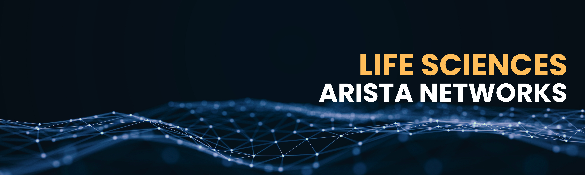

# __**Arista Life Sciences Quarterly Newsletter**__
Welcome back! Last time we covered AI in Life Sciences IT; this edition spotlights Arista’s Modern Operating Model, delivering consistent, real-time, high-performance networks across data centers and campuses.

---
<!-- ## __**Upcoming Events**__   -->

<!-- -   __**Local   Events**__ -->
-   

    | Date         | Name                                     | Description                                                                                                                                                                                                                         | Registration                                                                                       |
    |--------------|------------------------------------------|-------------------------------------------------------------------------------------------------------------------------------------------------------------------------------------------------------------------------------------|-------------------------------------------------------------------------------------------------------------|
    | __March 26__  | MassBio: State of Possible Conference | This year’s *State of Possible* Conference spotlights the people and passion behind innovation. Arista Networks is a Copper Sponsor — come say hi at our booth!                                            | Omni Hotel Seaport   [Register](https://www.massbio.org/events/state-of-possible-conference/?utm_source=google&utm_medium=search&utm_campaign=ads&gad_source=1&gad_campaignid=23504506941&gbraid=0AAAAADFOxY3WsJo86KHccEokwEGgljNiL&gclid=CjwKCAiAwNDMBhBfEiwAd7ti1IJLx_auXrmt45AAJRNkmpIMm4L6WGJEm48vlEAnI-eMdce-oZEMuBoCbgsQAvD_BwE){.register-link}      

## __**A Modern Approach to Infrastructure**__
It starts at 2:17 AM.

A critical application slows. An alert fires. An engineer logs in remotely, pivots between dashboards, opens a terminal window, and begins typing commands, device by device. Knowledge lives in runbooks. Changes require maintenance windows. Progress depends on heroics.

This is the legacy operating model. It worked when networks moved slowly. But today’s networks don’t move slowly.

Today, AI clusters spin up in hours. Research pipelines generate petabytes overnight. Mission-critical applications expect continuous availability. The business operates in real time, yet many networks are still managed one CLI session at a time. 

Arista’s Modern Operating Model defines the path from manual operations to real-time intelligence. Organizations evolve from reactive, device-centric management to Infrastructure-as-Code, validated automation, and Network CI pipelines built on a single source of truth, ultimately enabling predictive, AI-driven operations.

At each stage, operational velocity accelerates: from multi-year cycles to quarters, to weeks, to days, to hours, and finally to real time.

### **Software Discipline Embedded in Design**

#### ***In today’s modern operating model, success isn’t defined by whether you can automate; it’s defined by whether that automation is disciplined, validated, and operationally safe.***

Many network environments still rely on custom scripting, fragmented toolsets, and extensive internal upskilling to enable automation, often resulting in inconsistent architectures and operational risk.

Arista takes a fundamentally different approach by embedding software discipline directly into the network through [Arista Validated Designs](https://www.arista.com/en/solutions/design-guides) (AVD) and CloudVision. Topology logic, compliance checks, change validation, and streaming telemetry are built into the platform, not bolted on after the fact. This is automation as a *scalable, operational standard.*

### **The Scientific Method Applied to Infrastructure**

In life sciences, quality is foundational. Whether running high-throughput screens or managing GxP-regulated manufacturing, the integrity of your data depends entirely on **stable, reliable infrastructure**. Yet while lab instruments have advanced exponentially, the networks connecting them often lag behind, relying on **manual, error-prone processes** that threaten consistency.

Arista’s[ Modern Operating Model](https://www.arista.com/en/products/eos-network-solutions-overview) advocates for a **fundamental shift:** treat infrastructure with the same rigor, reproducibility, and validation as the science it supports.

### **The Network as a Deterministic Platform**

Traditional networking often relies on "snowflake" configurations: unique, manually tweaked settings that drift over time and create fragility. Arista’s approach [champions ruthless simplification and Infrastructure-as-Code](https://siliconangle.com/2022/11/06/aristas-continuous-integration-pipeline-brings-cloud-principles-network). 

By defining the network through software-based templates rather than manual configurations, organizations gain a procedurally generated, version-controlled, and fully reproducible infrastructure foundation. The outcome is deterministic, automated standards that reduce operational risk and ensure consistent performance across the entire IT environment.

**Pre-Deployment Trials for Your Configuration**

You wouldn’t push a major system change without testing it first, so why deploy network updates straight to production?

With **[Digital Twin](https://www.arista.com/assets/data/pdf/Whitepapers/Network-Migrations-Derisking-Transformations-WP.pdf)**[s](https://www.arista.com/assets/data/pdf/Whitepapers/Network-Migrations-Derisking-Transformations-WP.pdf), IT teams can stage changes in a sandboxed replica of the live environment, validating updates before they ever touch production. Configuration changes, policy updates, and automation workflows are tested under real-world conditions to minimize risk to uptime, security, and performance.

By the time changes are deployed, they’re already proven, repeatable, and compliant. The result: a shift from reactive troubleshooting to proactive operational assurance across the entire IT environment.

### **From Troubleshooting to Observability**

When a data transfer stalls or an application hangs, you need the root cause. Legacy monitoring often tells you *that* something is down; [Modern Observability](https://www.arista.com/en/products/eos/telemetry-analytics) tells you *why*.  By utilizing time-series telemetry and state-aware analytics, the network provides a continuous stream of truth regarding its health. 

***Arista’s [Telemetry Tracers](https://www.arista.com/en/solutions/telemetry-analytics), including VMtracer, MapReduce tracer, and Container tracer, extend this visibility beyond the network into workloads running across HPC, cloud, containerized, and virtualized environments.***

For organizations running genomic sequencing, AI/ML pipelines, or large-scale data analytics, this workload-level insight directly correlates application behavior with network state, helping teams pinpoint whether performance issues stem from infrastructure, orchestration, or the application itself.

## __**Wrap Up & Looking Ahead**__

Adopting a Modern Operating Model brings cloud-like agility and scale to on-premises environments while maintaining the control required for regulated operations. By eliminating human error and enforcing consistency, the network shifts from a source of risk to a foundation of confidence, enabling IT teams to deliver services faster and more reliably.

Look out for our upcoming life sciences events and webinars. At these events, we’ll share insights from leading research organizations and discuss best practices for building HPC and AI-ready networks.

---
*Ready to explore what’s possible today? Connect with our Life Sciences team to see how Arista can help accelerate your next discovery. Email: [noork@arista.com](mailto:nelifesciences@arista.com)*

---

Resources
[Arista Labs](https://labs.arista.com/){ .resource-link }
[CloudVision Chats Ep 1 - Realtime Telemetry vs Polling](https://www.youtube.com/watch?v=t22vWu9wvtA){ .resource-link }
[CloudVision Chats Ep 4 - Evolution of software upgrades: Smart System Upgrade](https://www.youtube.com/watch?v=ZuBe5B4EpsI){ .resource-link }

